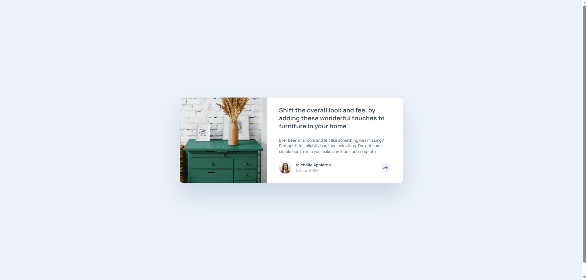

# Frontend Mentor - Article preview component solution

This is a solution to the [Article preview component challenge on Frontend Mentor](https://www.frontendmentor.io/challenges/article-preview-component-dYBN_pYFT). 

## Table of contents

- [Overview](#overview)
  - [The challenge](#the-challenge)
  - [Screenshot](#screenshot)
  - [Links](#links)
- [My process](#my-process)
  - [Built with](#built-with)
  - [What I learned](#what-i-learned)
  - [Continued development](#continued-development)
  - [Useful resources](#useful-resources)
- [Author](#author)
- [Acknowledgments](#acknowledgments)

## Overview

### The challenge

Users should be able to:

- View the optimal layout for the component depending on their device's screen size
- See the social media share links when they click the share icon

### Screenshot

### Links

- [Solution](https://your-solution-url.com)
- [Live Site](https://your-live-site-url.com)

## My process

### Built with

- Semantic HTML5 markup
- Tailwind
- Vanilla JavaScript
- Flexbox
- Mobile-first workflow
- [Vite](https://vite.dev/) - Build tool

### What I learned

This was the first project where I finally got to use Tailwind—and more importantly, JavaScript!

Tailwind really impressed me. It saves a ton of time, and if you're already comfortable with vanilla CSS, the transition is super smooth. You don’t have to switch between your HTML and CSS files all the time—just apply utility classes and focus on layout, styling, and fine-tuning the design.

I also got to put my basic JavaScript knowledge into action. I used variables, functions, `if...else`, `addEventListener`, and some DOM manipulation. It felt great to build the interactivity I needed without running into major issues. Even though it’s just beginner-level stuff, it was really satisfying to see it all work!

### Continued development

I’ll be focusing more on Tailwind and JavaScript moving forward. I want to get more comfortable using Tailwind classes efficiently and keeping my HTML clean and readable—since things can get messy pretty quickly with utility classes.

On the JavaScript side, I’m working on writing more vanilla JS and really understanding the core concepts. The goal is to make my transition to React as smooth as possible.

### Useful resources

- [Tailwind cheat sheet](https://nerdcave.com/tailwind-cheat-sheet) - helpful whenever I needed to quickly look up a class I wasn’t familiar with. Definitely a go-to resource while working on this project.